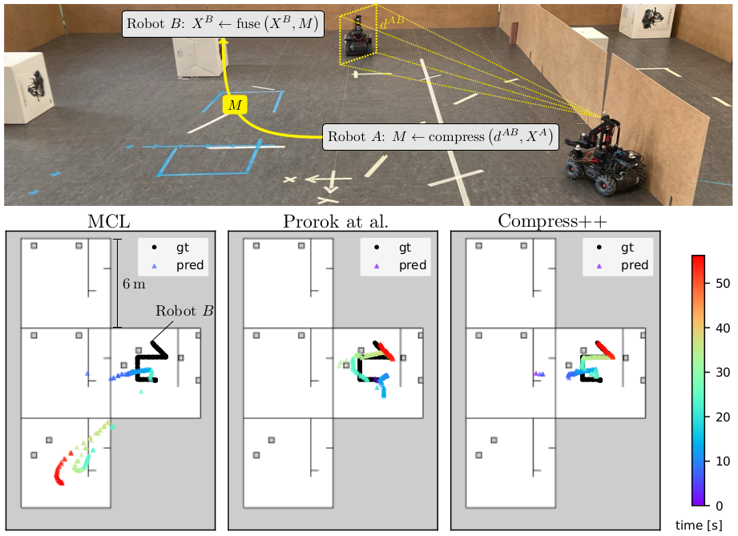
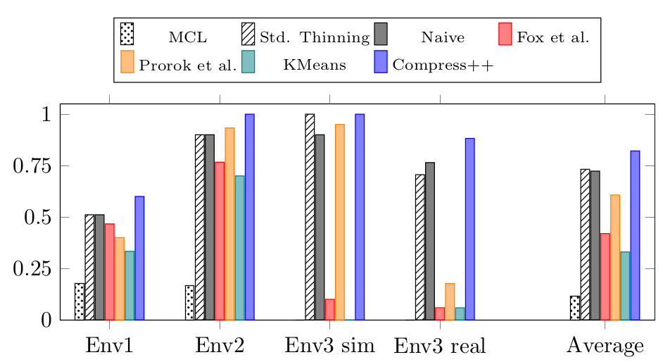

# Resource-Aware Collaborative Monte Carlo Localization with Distribution Compression
This repository contains the implementation of the following [publication](https://arxiv.org/abs/2404.02010):
```bibtex
@misc{zimmerman2024arxiv,
      title={{Resource-Aware Collaborative Monte Carlo Localization with Distribution Compression}}, 
      author={Nicky Zimmerman and Alessandro Giusti and Jérôme Guzzi},
      year={2024},
      eprint={2404.02010},
      archivePrefix={arXiv},
      primaryClass={cs.RO}
}
```
Under review for IROS 2024.

## Abstract
 Global localization is essential in enabling robot autonomy, and collaborative localization is key for multi-robot systems. 
 In this paper, we address the task of collaborative global localization under computational and communication constraints. We propose a method which reduces the amount of information exchanged and the computational cost. We also analyze, implement and open-source seminal approaches, which we believe to be a valuable contribution to the community.  
  We exploit techniques for distribution compression in near-linear time, with error guarantees. 
  We evaluate our approach and the implemented baselines on multiple challenging scenarios, simulated and real-world. Our approach can run online on an onboard computer. We release an open-source C++/ROS2 implementation of our approach, as well as the baselines.
  <p align="center">

</p>

## Results
We conducted a thorough evaluation of the different approaches to cooperative localization. We present our experiments to show the capabilities of our method, Compress++ MCL. 
The results support the claims that our proposed approach (i) improves collaborative localization, (ii) decreases the required band-width, (iii) reduces the computational load, (iv) runs online
on an onboard computer.

  <p align="center">

</p>

## Installation
We provide Docker installations for ROS 2 Humble. Make sure you installed Docker Engine and NVidia container so you can run Dokcer with GPU support. 
Download the external resources in the host machine into the `/ros_ws/src` directory
```bash
git clone git@github.com:jeguzzi/robomaster_ros.git
git clone git@github.com:jeguzzi/optitrack_msgs.git
```
These packages are necessarily for running the demo as the rosbag includes RoboMaster specific detection messages and ground truth poses from the OptiTrack system. However, they are not strictly necessary for any of the approaches, and the dependency can be removed with a bit of work on the ROS wrapper. In the root directory, run  
```bash
sudo make humble=1
```
To build the Docker. To enable RVIZ visualization from the Docker run in the host machine
```bash
 xhost +local:docker
```
To run the Docker
```bash
sudo make run humble=1
```
Then in the Docker, build the code
```bash
cd ncore && mkdir build && cd build && cmake .. -DBUILD_TESTING=1 && make -j12 
cd ros2_ws && . /opt/ros/humble/setup.bash &&  colcon build && . install/setup.bash
```

## Running the Algo
Code will be published this week (during the first week of April)! 
